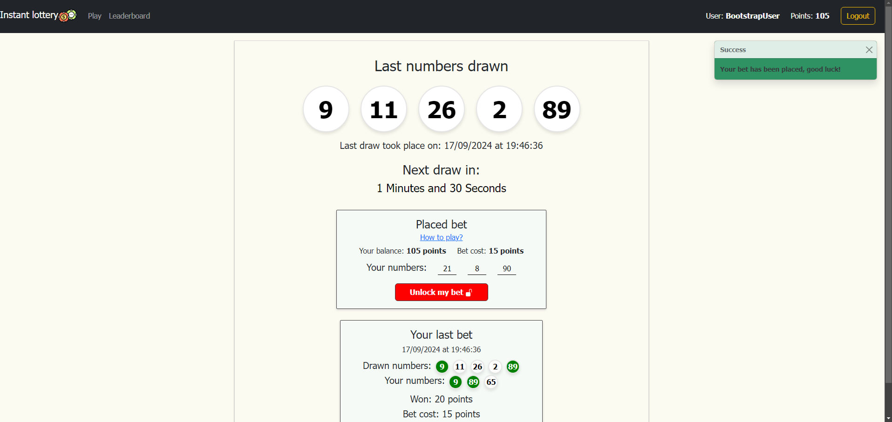
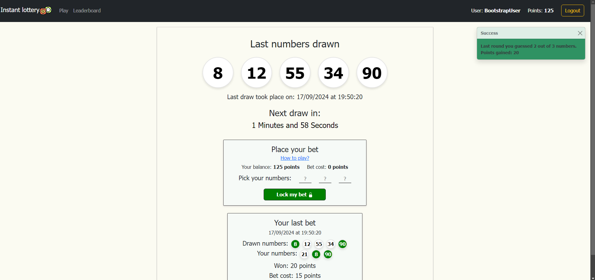

# PoliTO Web Application Exam:  "Instant Lottery"

## Student: s332262 Ferraiuolo Pasquale 

## React Client Application Routes

- Route `/`: Login screen. This is the only page that can be accessed from non-logged user. Logged-in user cannot access this page.
- Route `/lottery`: Lottery page. This is the "main page", it allows the user to play the instant lottery game. Users can see the drawn numbers, their last bet and place new bet.
- Route `/leaderboard`: Leaderboard page. This page shows the first 3 users in terms of points.
- Route `/*`: 404 page. This page is shown when the user tries to access a page that doesn't exist.

## Main React Components

- `PlayLottery` (in `components/lottery/PlaceBet.jsx`): The main lottery component that, in addition to being the parent of the 3 components listed below, displays the latest 5 drawn numbers.
- `PlaceBet` (in `components/lottery/PlaceBet.jsx`): Allows the user to place a bet for the next draw or to remove the current bet if it has already been placed.
- `LastBetResult` (in `components/lottery/LastBetResult.jsx`): Displays the last bet the user placed and the result of that bet (even if it is an old one)
- `CountdownTimer` (in `components/lottery/CountdownTimer.jsx`): Shows a countdown timer until the next draw.
- `LoginScreen` (in `components/LoginScreen.jsx`): Allows the user to log in with a username and password. It is the first screen the user sees when they open the app.
- `Leaderboard` (in `components/Leaderboard.jsx`): Shows the top three users in terms of points.
- `NavigationBar` (in `components/NavigationBar.jsx`): The navigation bar of the app, always displayed at the top.
  
Minor components, that are described in code by comments on top of them, include: `ToastWrapper`, `RulesModal`, `ProtectedRoute`, `UserContext`, `ToastContext`.

## API Server

- POST `/api/auth/`: API for logging in a user.
  - Request body content: username, password
  - Response body content: username of the logged user
  - Response status code: 200
  - Possible errors: 422 (missing/invalid parameters), 401 (wrong credentials)
- DELETE `/api/auth/current`: API for logging out the currently logged in user.
  - Requires the user to be logged in
  - Response status code: 204
  - Possible errors: 401 (not logged in), 500 (server error)
- GET `/api/auth/current`: API for retrieving the currently logged in user and his points
  - Requires the user to be logged in
  - Response body content: username of the logged user and his points
  - Response status code: 200
  - Possible errors: 401 (not logged in), 500 (server error)
- GET `/api/lottery/last`: API for retreiving the latest lottery draw
  - Requires the user to be logged in
  - Response body content: the last 5 drawn numbers and the timestamp of the draw
  - Response status code: 200
  - Possible errors: 401 (not logged in), 500 (server error)
- GET `/api/lottery/next`: API for retreiving the timestamp of the next lottery draw
  - Requires the user to be logged in
  - Response body content: the timestamp of the next draw
  - Response status code: 200
  - Possible errors: 401 (not logged in), 500 (server error)
- GET `/api/lottery/leaderboard`: API for retreiving the first 3 users in terms of points
  - Requires the user to be logged in
  - Response body content: top 3 user with the most points
  - Response status code: 200
  - Possible errors: 401 (not logged in), 500 (server error)
- POST `/api/bet/` API for placing a bet on the next draw for the logged user
  - Requires the user to be logged in
  - Request body content: an array of 1 to 3 numbers
  - Response status code: 204
  - Possible errors: 401 (not logged in), 422 (missing/invalid parameters), 500 (server error) 
- DELETE `/api/bet/` API for removing the bet on the next draw for the logged user
  - Requires the user to be logged in
  - Response status code: 204
  - Possible errors: 401 (not logged in), 500 (server error)
- GET `/api/bet/result` API for retreiving the result of the user's last bet (**that has a result**)
  - Requires the user to be logged in
  - Response body content: the result of the last bet (the numbers drawn,the user's bet, correct numbers and timestamp of the draw) or an empty object if the user has no bet placed
  - Response status code: 200
  - Possible errors: 401 (not logged in), 500 (server error)
- GET `/api/bet/status` API for retreiving the status of the user's last bet (**that has no result**)
  - Requires the user to be logged in
  - Response body content: selected numbers by the user for the next draw or an empty array if the user has no bet placed
  - Response status code: 200
  - Possible errors: 401 (not logged in), 500 (server error)

## Database Tables

- Table `user` - Contains the user's information, including username, password (with salt) and points
- Table `game` - Contains the drawn numbers, timestamp of the draw and a boolean value indicating whether the draw has already occurred. This boolean value is used to check if the draw has been completed, as the game is created two minutes before with NULL values for the numbers and updated with the drawn numbers afterward.
- Table `bet` - Contains the user's bet (played numbers) and the number of correct matches (if the draw has already been played).

## Screenshots
Right after placing the bet, before the draw:

Right after the draw:

## Users Credentials

- MarcoBianchi, mySecretPsw! (No bet placed, 100 points)
- FreshPlayer, ready (No bet placed, 100 points)
- MarioRossi, WebApp (140 points)
- BootstrapUser, react-bootstrap (125 points)
- PFerra, React (75 points)
- UnluckyOne, MissingLuck (0 points)
